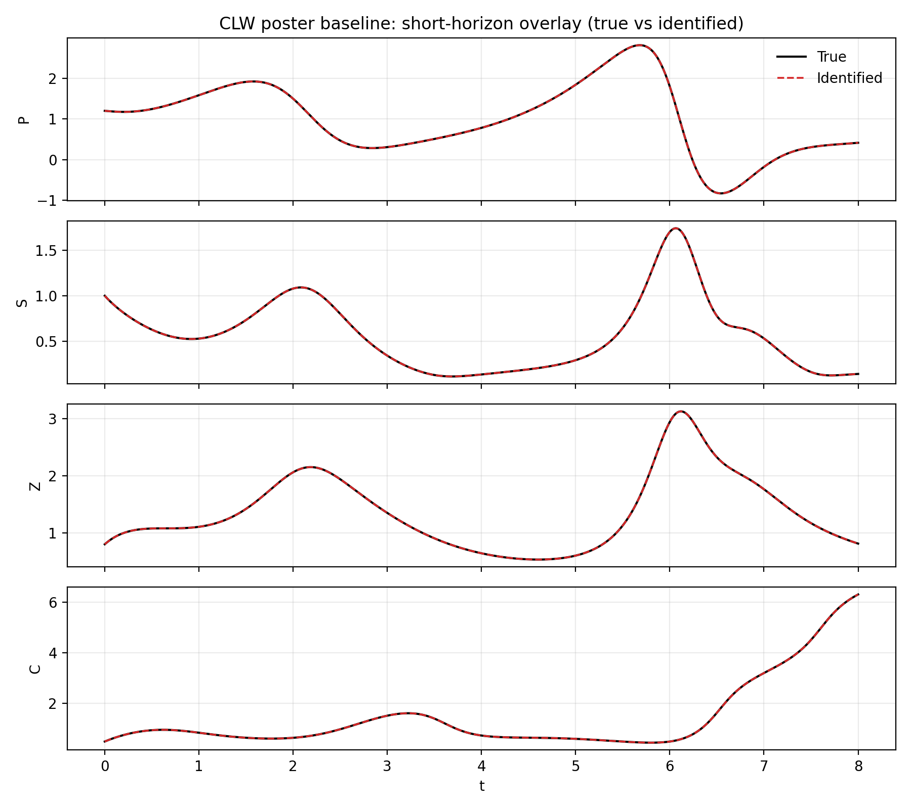
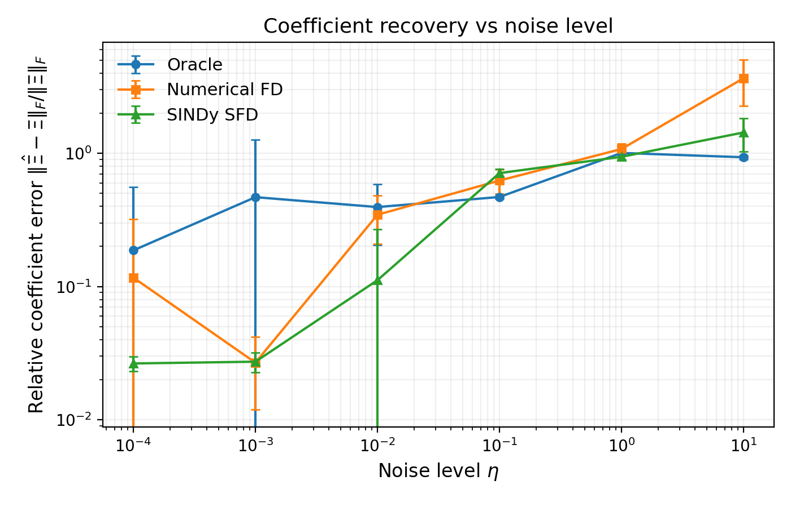

# Sparse Identification of Turbulence-State Dynamics for Fusion Plasmas

This repository benchmarks Sparse Identification of Nonlinear Dynamics on the Chen–Lin–White reduced turbulence-state model for fusion plasmas. The goal is to test when SINDy can recover the governing equations, and how recovery degrades under noise, numerical derivative estimation, and imperfect candidate libraries.

## Results

### Clean short-horizon recovery



### Coefficient recovery under noise



| Experiment            | What it tests                                                  |
| --------------------- | -------------------------------------------------------------- |
| Clean baseline        | Whether SINDy recovers the equations in the ideal setting      |
| Noisy states          | Robustness to measurement noise                                |
| Numerical derivatives | Degradation when derivatives must be estimated                 |
| Extended library      | False positives when the candidate library is less constrained |
| Incomplete library    | Failure when important terms are missing                       |

The underlying benchmark summary is available in [`docs/main_results.csv`](docs/main_results.csv).

## Quick start

```bash
git clone https://github.com/lucasperrier/sindy-clw.git
cd sindy-clw
python -m venv .venv
source .venv/bin/activate
pip install -r requirements.txt
python experiments/poster_baseline.py
```

To regenerate all benchmark results, run:

```bash
python experiments/run_all.py
```

## Repository structure

```text
experiments/      Benchmark entry points
sindy_library/    Physics-informed, extended, and incomplete candidate libraries
clw_model/        Chen–Lin–White model and shared utilities
docs/             Curated figures, results, and conference poster
```

## Limitations

This is a controlled benchmark, not a new SINDy algorithm. The results are based on a reduced four-dimensional turbulence-state model, so they should not be interpreted as direct validation on full tokamak plasma data. Long-horizon trajectory agreement is limited by chaotic sensitivity; coefficient recovery and short-horizon behavior are therefore emphasized.
